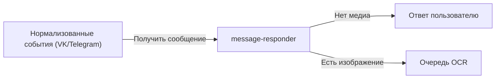
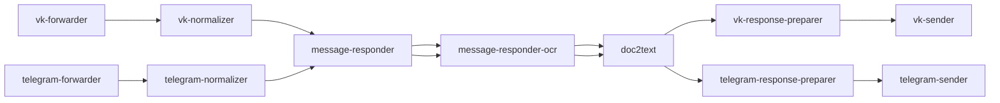

## О приложении

message-responder — событийный сервис, который читает нормализованные апдейты Telegram/VK из Kafka, пытается подобрать подходящий обработчик и формирует ответ для пользователя. Сейчас в него входят два хендлера: `HasFileHandler` перенаправляет сообщения с изображениями в OCR‑цепочку, а `DefaultHandler` показывает подсказку, если пришёл текст или неподдерживаемый формат.

## Роль приложения в архитектуре проекта

Компонент стоит в обоих конвейерах сразу после `vk-normalizer` и `telegram-normalizer`:


Он является точкой принятия решения: при наличии медиа пересылает событие в `message-responder-ocr` (через отдельный Kafka‑топик), а пользователю отправляет уведомление «изображение взято в работу». Если картинок нет, сервис даёт понятный ответ и завершает цепочку, чтобы не грузить OCR.

## Локальный запуск

1. Подготовьте окружение: Go ≥ 1.24, доступ к Kafka (SASL/PLAIN опционально), а также настроенные upstream‑сервисы (`message-responder-ocr`, `response-preparer`, `sender`), чтобы видеть полный поток.
2. Экспортируйте переменные окружения для Kafka:
   - `KAFKA_BOOTSTRAP_SERVERS_VALUE` — список брокеров.
   - `KAFKA_GROUP_ID_MESSAGE_RESPONDER` — consumer group для чтения нормализованных сообщений.
   - `KAFKA_TOPIC_NAME_NORMALIZED_MSG` — входной топик от нормализаторов.
   - `KAFKA_TOPIC_NAME_OCR_REQUEST` — куда отправлять заявки на OCR.
   - `KAFKA_TOPIC_NAME_TEMP_RESPONSE_PREPARER` — базовое имя выходного топика для подготовителей ответов; реальный топик строится как `<source><суффикс>`.
   - `KAFKA_CLIENT_ID_MESSAGE_RESPONDER` — client id Kafka.
   - `KAFKA_SASL_USERNAME`/`KAFKA_SASL_PASSWORD` — задавайте только если брокер требует SASL/PLAIN.
3. Соберите и запустите сервис:
   ```bash
   go run ./cmd/message-responder
   ```
   Либо используйте образ `docker build -t message-responder .` и передайте те же переменные при запуске контейнера.
4. Убедитесь, что консьюмер подписан на нужный топик, а ответы появляются в `<source><KAFKA_TOPIC_NAME_TEMP_RESPONSE_PREPARER>`.
